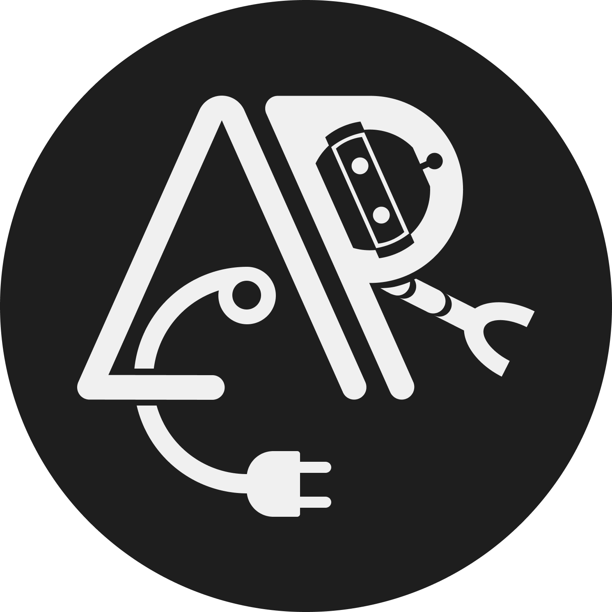

# Advanced Robotics Club (ARC) - ACEM 🤖

Welcome to the official repository for the **Advanced Robotics Club (ARC)** at the [Advanced College of Engineering and Management (ACEM)](http://arc.acem.edu.np). 

Established in 2012 in Kalanki, Nepal, ARC is a vibrant community of robotics enthusiasts, engineers, and innovators. We are committed to providing a platform for students to develop their ideas, implement real-world engineering solutions, and become the brightest technical minds in the nation.

---

## 🎯 Our Mission
To bridge the gap between theoretical knowledge and practical application by fostering a hands-on environment where students can explore robotics, artificial intelligence, and embedded systems.

## 🚀 What We Do
We annually conduct various training programs, workshops, and national-level competitions, including:

* **Hardware & Electronics:** Hands-on training in custom PCB Designing, advanced soldering techniques, and mechanical assembly.
* **Programming Seminars:** Logic-building workshops featuring Embedded C and AVR microcontroller programming.
* **Technorion Nepal:** Proud organizers of the International Selection of Nepal for Techfest, IIT Bombay, for 4 consecutive years.
* **App-Controlled Robotics:** Building, programming, and racing custom smartphone-controlled robotic systems.

---

## 💻 About This Repository (Website)
This repository contains the source code for the official ARC website. It is built with modern web technologies to ensure a fast, responsive, and highly interactive user experience.

### Tech Stack
* **Framework:** [Next.js](https://nextjs.org/) (App Router)
* **Styling:** [Tailwind CSS v4](https://tailwindcss.com/)
* **Animations:** [Framer Motion](https://www.framer.com/motion/)
* **Icons:** [Lucide React](https://lucide.dev/)
* **Language:** TypeScript